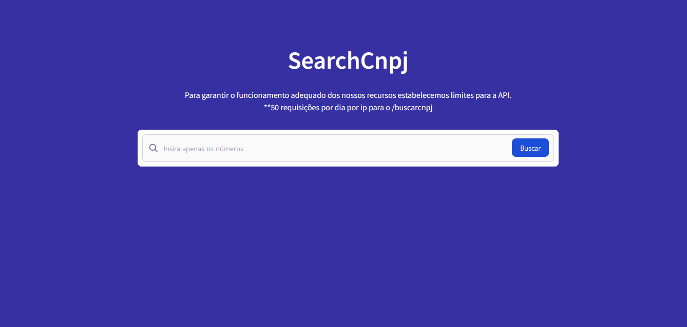

# SearchCnpj 


A SearchCnpj é uma aplicação de busca de informações mediante o número do cnpj da empresa, com essa solução é possível visualizar uma grande quantidade de informações referente a mesma.

## 📋 Funcionalidades do Sistema

   [x] Buscar informações referente a uma empresa.

## 👨‍🏫 Demostração do Sistema



## 🔨Tecnologias Utilizadas

 1. JavaScript(fetch api)
 2. [tailwindcss(Mobile First)](https://tailwindcss.com/)
 3. Html

## 🌐 Acessar o projeto.
### [SearchCnpj](https://felipefreela-portfolio.vercel.app/projetos/searchcnpj/src/index.html)

## 👨‍💻 Como executar o projeto.


### 1. Baixe o projeto
```sh
git clone git@github.com:FelipeDevFull/searchcnpj.git
```
### 2. clique no arquivo "index.html" dentro da pasta "searchcnpj/src/".

